# Project-1: Vprofile Project:Multi Tier Web Application Stack Setup Locally

[*Project Source*](https://www.udemy.com/course/devopsprojects/?src=sac&kw=devops+projects)


## PreRequisites Installed:
  * Oracle VM VirtualBox Manager
  * Vagrant
  * Vagrant plugins
  * Git
  * IDE (SublimeText, VSCode, etc)

## Step1: VM Setup

- First clone the repository
```sh
git clone https://github.com/DOGAN2010/dogan-vprofile-project.git
git branch local-setup
git checkout local-setup

```


- We need to go to directory that our Vagrantfile exists. Before we run our VBoxes using `vagrant`, we need to install below plugin.
```sh
vagrant plugin install vagrant-hostmanager
```

- After plugin installed, we can run below command to setup our VMs.
```sh
vagrant up
```
PS: Bringing VMs can take long time sometimes. If VM setup stops in the middle, run `vagrant up` command again.

- We can check our VMs from `Oracle VM VirtualBox Manager`.


- Next we will validate our VMs one by one with command `vagrant ssh <name_of_VM_given_in_Vagrantfile>`
```sh
vagrant ssh web01
```

- First we will check `/etc/hosts` file. Since we have installed the plugin, `/etc/hosts` file will be updated automatically.
```sh
cat /etc/hosts
```

- Now we will try to ping `app01` from `web01` vbox.
```sh
ping app01
```


- We are able to connect `app01` successfully. Now we will check other services similarly.
```sh
logout
```

- Lets connect to `app01` vbox and check connectivity of `app01` with `rmq01`, `db01` and `mc01`.
```sh
cat /etc/hosts
ping rmq01
ping db01
ping mc01
logout
```

## Step2: Provisioning

- We have 6 different services for our application.
```sh
Services
1. Nginx:
Web Service
2. Tomcat
Application Server
3. RabbitMQ
Broker/Queuing Agent
4. Memcache
DB Caching
5. ElasticSearch
Indexing/Search service
6. MySQL
SQL Database
```


- We need to setup our services in below mentioned order.
```sh
1. MySQL (Database SVC)
2. Memcache (DB Caching SVC)
3. RabbitMQ  (Broker/Queue SVC)
4. Tomcat      (Application SVC)
5. Nginx (Web SVC)
```

### Provisioning MySQL 

- Let's start setting up our MySQL Database first.
```sh
vagrant ssh db01
```

- Switch to root user and update all packages. It is always a good practice to update OS with latest patches, when we log into the VM. 
```sh
sudo su -
yum update -y
```

- First we will set our db password using `DATABASE_PASS` environment variable and add it to `/etc/profile` file
```sh
DATABASE_PASS='admin123'
```

- This variable will be temporary, to make it permanent we need to add it `/etc/profile` file and update file.
```sh
vi /etc/profile
source /etc/profile
```

- Next we will install the `EPEL(Extra Packages for Enterprise Linux)` repository. Extra Packages for Enterprise Linux (EPEL) is a special interest group (SIG) from the Fedora Project that provides a set of additional packages for RHEL (and CentOS, and others) from the Fedora sources.
```sh
yum install epel-release -y
```

- Now we can install Maria DB Package
```sh
yum install git mariadb-server -y
```
- Mariadb is installed, now we will start and enable mariadb service. We can also check the status of mariadb service to make sure it is `active(running)`.
```sh
systemctl start mariadb
systemctl enable mariadb
systemctl status mariadb
```

- RUN mysql secure installation script.
```sh
mysql_secure_installation
```

- NOTE: Set db root password, we will be using `admin123` as password
```
Set root password? [Y/n] Y
New password:
Re-enter new password:
Password updated successfully!
Reloading privilege tables..
... Success!
By default, a MariaDB installation has an anonymous user, allowing anyone
to log into MariaDB without having to have a user account created for
them.  This is intended only for testing, and to make the installation
go a bit smoother.  You should remove them before moving into a
production environment.
Remove anonymous users? [Y/n] Y
... Success!
Normally, root should only be allowed to connect from 'localhost'.  This
ensures that someone cannot guess at the root password from the network.
Disallow root login remotely? [Y/n] n
... skipping.
By default, MariaDB comes with a database named 'test' that anyone can
access.  This is also intended only for testing, and should be removed
before moving into a production environment.
Remove test database and access to it? [Y/n] Y
- Dropping test database...
... Success!
- Removing privileges on test database...
... Success!
Reloading the privilege tables will ensure that all changes made so far
will take effect immediately.
Reload privilege tables now? [Y/n] Y
... Success!
```

- We can check our connectivity to db with below command: Once it asks password, we will enter `admin123` as we set in previous step. After it connects successfully, we can `exit` from DB.
```sh
mysql -u root -p
exit
```

- Next we will clone source code to database vm. And change directory to `src/main/resources/` to get the `sql queries.
```
git clone https://github.com/DOGAN2010/dogan-vprofile-project.git
cd vprofile-project/src/main/resources/
```
- First we will run below queries before initializing our database.
```sh
mysql -u root -p"$DATABASE_PASS" -e "create database accounts"
mysql -u root -p"$DATABASE_PASS" -e "grant all privileges on accounts.* TO 'admin'@'app01' identified by 'admin123' "
cd ../../..
mysql -u root -p"$DATABASE_PASS" accounts < src/main/resources/db_backup.sql
mysql -u root -p"$DATABASE_PASS" -e "FLUSH PRIVILEGES"
```

-  Now we can login to database and do a quick verification to see if SQL queries start a databases with `role` ,`user` and `user_role` tables.
```sh
mysql -u root -p"$DATABASE_PASS"
MariaDB [(none)]> show databases;
MariaDB [(none)]> use accounts;
MariaDB [(none)]> show tables;
exit
```

- As last step, we can restart our `mariadb` server and `logout`.
```sh

systemctl restart mariadb
logout
```

### Provisioning Memcache

- Lets login to memcached server first, and switch to root user.
```sh
vagrant ssh mc01
sudo su -
```

- Similar to MySQL provisioning, we will start with updating OS with latest patches and download epel repository.
```sh
yum update -y
yum install epel-release -y
```

- Now we will install `memcached` package.
```sh
yum install memcached -y
```

- Lets start/enable the memcached service and check the status of service.
```sh
systemctl start memcached
systemctl enable memcached
systemctl status memcache
```

- We will run one more command to that `memcached` can listen on TCP port `11211` and UDP port `11111`.
```sh
memcached -p 11211 -U 11111 -u memcached -d
```

- We can validate if it is running on right port with below command:
```sh
ss -tunlp | grep 11211
``` 

- Everthing looks good, we can exit from server with `exit` command.

### Provisioning RabbitMQ

- Lets login to Rabbit MQ server first, and switch to root user.
```sh
vagrant ssh rmq01
sudo su -
```

- We will start with updating OS with latest patches and download epel repository.
```sh
yum update -y
yum install epel-release -y
```

- Before installing `RabbitMQ`, we will install some dependecies first.
```sh
yum install wget -y
cd /tmp/
wget http://packages.erlang-solutions.com/erlang-solutions-2.0-1.noarch.rpm
sudo rpm -Uvh erlang-solutions-2.0-1.noarch.rpm
``` 

- Now we can install RabbitMQ server. With below command, we will install the script and pipe with shell to execute the script.
```sh
curl -s https://packagecloud.io/install/repositories/rabbitmq/rabbitmq-server/script.rpm.sh | sudo bash
sudo yum install rabbitmq-server -y
```

- Lets start/enable the rabbitmq service and check the status of service.
```sh
systemctl start rabbitmq-server
systemctl enable rabbitmq-server
systemctl status rabbitmq-server
```

- Lastly we need to do below config  for RabbitMQ. We will create a `test` user with password `test`. Then we will create user_tag for `test` user as `administrator`. Once we have done with these config changes, we will restart our rabbitmq service
```sh
cd ~
echo "[{rabbit, [{loopback_users, []}]}]." > /etc/rabbitmq/rabbitmq.config
rabbitmqctl add_user test test
rabbitmqctl set_user_tags test administrator
systemctl restart rabbitmq-server
```

- If your service active/running after restart, then we can move to the next service.
```sh
systemctl status rabbitmq-server
exit
```

### Provisioning Tomcat 

- Lets login to `app01` server first, and switch to root user.
```sh
vagrant ssh app01
sudo su -
```

- We will start with updating OS with latest patches and download epel repository.
```sh
yum update -y
yum install epel-release -y
```

- We will start with install dependencies for Tomcat server.
```sh
yum install java-1.8.0-openjdk -y
yum install git maven wget -y
```

- Now we can download Tomcat. First switch to `/tmp/` directory.
```sh
cd /tmp
wget https://archive.apache.org/dist/tomcat/tomcat-8/v8.5.37/bin/apache-tomcat-8.5.37.tar.
tar xzvf apache-tomcat-8.5.37.tar.gz
```

- We will add tomcat user and copy data to tomcat home directory. We can check the new user `tomcat` with `id tomcat` command.
```sh
useradd --home-dir /usr/local/tomcat8 --shell /sbin/nologin tomcat
```

- We will copy our data to `/usr/local/tomcat8` directory which is the home-directory for `tomcat` user.
```sh
cp -r /tmp/apache-tomcat-8.5.37/* /usr/local/tomcat8/
ls /usr/local/tomcat8
```

- Currently root user has ownership of all files under `/usr/local/tomcat8/` directory. We need to change it to `tomcat` user.
```sh
ls -l /usr/local/tomcat8/
chown -R tomcat.tomcat /usr/local/tomcat8
ls -l /usr/local/tomcat8/
``` 

- Next we will setup systemd for tomcat, create a file with below content. After creating this file, we will be able to start tomcat service with `systemctl start tomcat` and stop tomcat with `systemctl stop tomcat` commands.

```sh
vi /etc/systemd/system/tomcat.service
Content to add tomcat.service file:
[Unit]
Description=Tomcat
After=network.target

[Service]
User=tomcat
WorkingDirectory=/usr/local/tomcat8
Environment=JRE_HOME=/usr/lib/jvm/jre
Environment=JAVA_HOME=/usr/lib/jvm/jre
Environment=CATALINA_HOME=/usr/local/tomcat8
Environment=CATALINE_BASE=/usr/local/tomcat8
ExecStart=/usr/local/tomcat8/bin/catalina.sh run
ExecStop=/usr/local/tomcat8/bin/shutdown.sh
SyslogIdentifier=tomcat-%i

[Install]
WantedBy=multi-user.target
```

- Any changes made to file under `/etc/systemd/system/` directory, we need to run below command to be effective:
```sh
systemctl daemon-reload
```

- Now we should be able to enable tomcat service. The service name tomcat has to be same as given `/etc/systemd/system/tomcat.service` directory.
```sh
systemctl enable tomcat
systemctl start tomcat
systemctl status tomcat
```

- Our Tomcat server is active running, now we will build our source code and deploy it to Tomcat server.

#### Code Build & Deploy to Tomcat(app01) Server

- We are still in `/tmp` directory, we will clone our source code here.
```sh
git clone https://github.com/DOGAN2010/dogan-vprofile-project.git
ls
cd vprofile-project/
```

- Before we build our artifact, we need to update our configuration file that will be connect to our backend services db, memcached and rabbitmq service.
```sh
vi src/main/resources/application.properties
```

- application.properties file: Here we need to make sure the settings are correct. First check DB configuration. Our db server is `db01` , and we have `admin` user with password `admin123` as we setup. For memcached service, hostname is `mc01` and we validated it is listening on tcp port 11211. Fort rabbitMQ, hostname is `rmq01` and we have created user `test` with pwd `test`.

```sh
#JDBC Configutation for Database Connection
jdbc.driverClassName=com.mysql.jdbc.Driver
jdbc.url=jdbc:mysql://db01:3306/accounts?useUnicode=true&characterEncoding=UTF-8&zeroDateTimeBehavior=convertToNull
jdbc.username=admin
jdbc.password=admin123

#Memcached Configuration For Active and StandBy Host
#For Active Host
memcached.active.host=mc01
memcached.active.port=11211
#For StandBy Host
memcached.standBy.host=127.0.0.2
memcached.standBy.port=11211

#RabbitMq Configuration
rabbitmq.address=rmq01
rabbitmq.port=5672
rabbitmq.username=test
rabbitmq.password=test
```

- Run `mvn install` command which will create our artifact. Our artifact will be created `/tmp/vprofile-project/target/vprofile-v2.war`
```sh
cd target/
ls
```

- We will deploy our artifact `vprofile-v2.war` to Tomcat server. But before that, we will remove default app from our server. For that reason first we will shutdown server. The default app will be in `/usr/local/tomcat8/webapps/ROOT` directory.
```sh
systemctl stop tomcat
systemctl status tomcat
rm -rf /usr/local/tomcat8/webapps/ROOT
```

- Our artifact is under vprofile-project/target directory. Now we will copy our artifact to `/usr/local/tomcat8/webapps/` directory as `ROOT.war` and start tomcat server. Once we start the server, it will extract our artifact `ROOT.war` under `ROOT` directory. 
```sh
cd ..
cp target/vprofile-v2.war /usr/local/tomcat8/webapps/ROOT.war
systemctl start tomcat
ls /usr/local/tomcat8/webapps/
```

- By the time, our application is coming up we can provision our Nginx server.

### Provisioning Nginx 

- Our Nginx server is Ubuntu, despite our servers are RedHat. To update OS with latest patches run below command:
```sh
sudo apt update && sudo apt upgrade
```

- Lets install nginx onto our server.
```sh
sudo su -
apt install nginx -y
```

- We will create a Nginx configuration file under directory `/etc/nginx/sites-available/` with below content:
```sh
vi /etc/nginx/sites-available/vproapp
Content to add:
upstream vproapp {
server app01:8080;
}
server {
listen 80;
location / {
proxy_pass http://vproapp;
}
}
```

- We will remove default nginx config file:
```sh
rm -rf /etc/nginx/sites-enabled/default
```

- We will create a symbolic link for our configuration file using default config location as below to enable our site. Then restart nginx server.
```sh
ln -s /etc/nginx/sites-available/vproapp /etc/nginx/sites-enabled/vproapp
systemctl restart nginx
```

### Validate Application from Browser

- We are in web01 server, run `ifconfig` to get its IP address. So the IP address of our web01 is : `192.168.56.11`
```sh
enp0s8: flags=4163<UP,BROADCAST,RUNNING,MULTICAST>  mtu 1500
        inet 192.168.56.11
```
- First validate Nginx is running on browser `http://<IP_of_Nginx_server>`.


- Validate Db connection using credentials `admin_vp` for both username and password.


- Validate app is running from Tomcat server


- Validate RabbitMQ connection by clicking RabbitMQ
  


- Validate Memcache connection by clicking MemCache


- Validate data is coming from Database when user first time requests it.


- Validate data is coming from Memcached when user second time requests it.


### CleanUp

- We will got to the directory that we have `Vagrantfile`, and run below command to destroy all virtual machines.
```sh
vagrant destroy
```


- Check Oracle VM VirtualBox Manager if Vms are destroyed.


```
git add .
git commit -m "Project-1: Multi Tier Web Application Stack Setup Locally"
git push --set-upstream origin local-setup
git checkout main
git merge local-setup
git push origin main

```
# Project-2: Vprofile Project: Automated Setup of Multi Tier App, Locally

[*Project Source*](https://www.udemy.com/course/devopsprojects/?src=sac&kw=devops+projects)

## Prerequisites

 * Oracle VM VirtualBox Manager
 * Vagrant
 * Vagrant plugins
 * Git
 * IDE (SublimeText, VSCode, etc)

## Step1: Preparing Bash Scripts for VMs

```sh
git checkout local-setup
```

### Bash Script for DB

- In Project-1, we have setup our 3-Tier Application manually. This time we will create bash scripts to automate our VM creation/provisioning through Vagrantfile.

- First we will create `mysql.sh` file for our database.
```sh
#!/bin/bash
DATABASE_PASS='admin123'
sudo yum update -y
sudo yum install epel-release -y
sudo yum install git zip unzip -y
sudo yum install mariadb-server -y


# starting & enabling mariadb-server
sudo systemctl start mariadb
sudo systemctl enable mariadb
cd /tmp/
git clone -b local-setup https://github.com/devopshydclub/vprofile-project.git
#restore the dump file for the application
sudo mysqladmin -u root password "$DATABASE_PASS"
sudo mysql -u root -p"$DATABASE_PASS" -e "UPDATE mysql.user SET Password=PASSWORD('$DATABASE_PASS') WHERE User='root'"
sudo mysql -u root -p"$DATABASE_PASS" -e "DELETE FROM mysql.user WHERE User='root' AND Host NOT IN ('localhost', '127.0.0.1', '::1')"
sudo mysql -u root -p"$DATABASE_PASS" -e "DELETE FROM mysql.user WHERE User=''"
sudo mysql -u root -p"$DATABASE_PASS" -e "DELETE FROM mysql.db WHERE Db='test' OR Db='test\_%'"
sudo mysql -u root -p"$DATABASE_PASS" -e "FLUSH PRIVILEGES"
sudo mysql -u root -p"$DATABASE_PASS" -e "create database accounts"
sudo mysql -u root -p"$DATABASE_PASS" -e "grant all privileges on accounts.* TO 'admin'@'localhost' identified by 'admin123'"
sudo mysql -u root -p"$DATABASE_PASS" -e "grant all privileges on accounts.* TO 'admin'@'%' identified by 'admin123'"
sudo mysql -u root -p"$DATABASE_PASS" accounts < /tmp/vprofile-project/src/main/resources/db_backup.sql
sudo mysql -u root -p"$DATABASE_PASS" -e "FLUSH PRIVILEGES"

# Restart mariadb-server
sudo systemctl restart mariadb


#starting the firewall and allowing the mariadb to access from port no. 3306
sudo systemctl start firewalld
sudo systemctl enable firewalld
sudo firewall-cmd --get-active-zones
sudo firewall-cmd --zone=public --add-port=3306/tcp --permanent
sudo firewall-cmd --reload
sudo systemctl restart mariadb
```

### Bash Script for Memcached

- Next we will create a bash script to provision our memcached server.
```sh
#!/bin/bash
sudo yum install epel-release -y
sudo yum install memcached -y
sudo systemctl start memcached
sudo systemctl enable memcached
sudo systemctl status memcached
sudo memcached -p 11211 -U 11111 -u memcached -d
```

### Bash Script for RabbitMQ

- This time we will create a bash script for RabbitMQ.
```sh
#!/bin/bash
sudo yum install epel-release -y
sudo yum update -y
sudo yum install wget -y
cd /tmp/
wget http://packages.erlang-solutions.com/erlang-solutions-2.0-1.noarch.rpm
sudo rpm -Uvh erlang-solutions-2.0-1.noarch.rpm
sudo yum -y install erlang socat
curl -s https://packagecloud.io/install/repositories/rabbitmq/rabbitmq-server/script.rpm.sh | sudo bash
sudo yum install rabbitmq-server -y
sudo systemctl start rabbitmq-server
sudo systemctl enable rabbitmq-server
sudo systemctl status rabbitmq-server
sudo sh -c 'echo "[{rabbit, [{loopback_users, []}]}]." > /etc/rabbitmq/rabbitmq.config'
sudo rabbitmqctl add_user test test
sudo rabbitmqctl set_user_tags test administrator
sudo systemctl restart rabbitmq-server
```

### Bash Script for Application

- We will create a Bash script to provision Tomcat server for our application.
```sh
TOMURL="https://archive.apache.org/dist/tomcat/tomcat-8/v8.5.37/bin/apache-tomcat-8.5.37.tar.gz"
yum install java-1.8.0-openjdk -y
yum install git maven wget -y
cd /tmp/
wget $TOMURL -O tomcatbin.tar.gz
EXTOUT=`tar xzvf tomcatbin.tar.gz`
TOMDIR=`echo $EXTOUT | cut -d '/' -f1`
useradd --shell /sbin/nologin tomcat
rsync -avzh /tmp/$TOMDIR/ /usr/local/tomcat8/
chown -R tomcat.tomcat /usr/local/tomcat8

rm -rf /etc/systemd/system/tomcat.service

cat <<EOT>> /etc/systemd/system/tomcat.service
[Unit]
Description=Tomcat
After=network.target

[Service]

User=tomcat
Group=tomcat

WorkingDirectory=/usr/local/tomcat8

#Environment=JRE_HOME=/usr/lib/jvm/jre
Environment=JAVA_HOME=/usr/lib/jvm/jre

Environment=CATALINA_PID=/var/tomcat/%i/run/tomcat.pid
Environment=CATALINA_HOME=/usr/local/tomcat8
Environment=CATALINE_BASE=/usr/local/tomcat8

ExecStart=/usr/local/tomcat8/bin/catalina.sh run
ExecStop=/usr/local/tomcat8/bin/shutdown.sh


RestartSec=10
Restart=always

[Install]
WantedBy=multi-user.target

EOT

systemctl daemon-reload
systemctl start tomcat
systemctl enable tomcat

git clone -b local-setup https://github.com/devopshydclub/vprofile-project.git
cd vprofile-project
mvn install
systemctl stop tomcat
sleep 60
rm -rf /usr/local/tomcat8/webapps/ROOT*
cp target/vprofile-v2.war /usr/local/tomcat8/webapps/ROOT.war
systemctl start tomcat
sleep 120
cp /vagrant/application.properties /usr/local/tomcat8/webapps/ROOT/WEB-INF/classes/application.properties
systemctl restart tomcat
```

### Bash Script for Nginx server

- Lastly we will create a bash script to provision Nginx server which will forward requests to our backend application.
```sh
# adding repository and installing nginx		
apt update
apt install nginx -y
cat <<EOT > vproapp
upstream vproapp {

 server app01:8080;

}

server {

  listen 80;

location / {

  proxy_pass http://vproapp;

}

}

EOT

mv vproapp /etc/nginx/sites-available/vproapp
rm -rf /etc/nginx/sites-enabled/default
ln -s /etc/nginx/sites-available/vproapp /etc/nginx/sites-enabled/vproapp

#starting nginx service and firewall
systemctl start nginx
systemctl enable nginx
systemctl restart nginx
```

## Step2: Preparing Bash Scripts for VMs

- First clone the repository
```sh
git clone https://github.com/DOGAN2010/vprofile-project.git
```

- We need to go to directory that our Vagrantfile exists. Before we run our VBoxes using `vagrant`, we need to install below plugin.
```sh
vagrant plugin install vagrant-hostmanager
```

- After plugin installed, we can run below command to setup our VMs which will also bootstrap our servers for us.
```sh
vagrant up
```

- Our VMs are ready in VirtualBox.

## Step3: Validate Application from Browser

- We can validate the application using hostname given in Vagrantfile. Go to browser `http://web01`. Frontend is working successfully.


- Backend services also up/running. 


- We can validate RabbitMq service.


- Next we can check our DB/Memcache services.


- If we want to stop our VMs, we can use below command:
```sh
vagrant halt
```

- We can check status of our VMs with below command:
```sh
vagrant status
```

- If we want to start again, we can easily run:
```sh
vagrant up 
```

- Once we are done, we can destroy our VMs:
```sh
vagrant destroy
```


```
git add .
git commit -m "Project-2: Automated Setup of Multi Tier App, Locally"
git push --set-upstream origin local-setup
git checkout main
git merge local-setup
git push origin main

```

# Project-3:Lift&Shift Application Workflow to AWS

[*Project Source*](https://www.udemy.com/course/devopsprojects/?src=sac&kw=devops+projects)

## Prerequisites:
 * AWS Account
 * Registered DNS Name
 * Maven
 * JDK8
 * AWS CLI

## Preparing Bash Scripts for VMs

```sh
git checkout -b aws-LiftAndShift
```


##### Architecture on DataCenter:


##### Architecture on AWS:


### Step-1: Create Security Groups for Services

- We will create `vprofile-ELB-SG` first. We will configure `Inbound` rules to Allow both `HTTP` and `HTTPS` on port `80` and `443` respectively  from Anywhere `IPv4` and `IPv6`.


- Next we will create `vprofile-app-SG`. We will open port `8080` to accept connections from `vprofile-ELb-SG`.


- Finally, we will create `vprofile-backend-SG`. WE need to open port `3306` for `MySQL`, `11211` for `Memcached` and `5672` for `RabbitMQ` server. We can check whcih ports needed fro aplication services to communicate each other from `application.properties` file under `src/main/resources` directory.We also need to open commucation `AllTraffic` from own SecGrp for backend services to communicate with each other.


### Step-2: Create KeyPair to Connect EC2 instances

- We will create a Keypair to connect our instances via SSH.


### Step-3: Provision Backend EC2 instances with UserData script

##### DB Instance:

- Create DB instance with below details.We will also add Inbound rule to `vprofile-backend-SG` for `SSH` on port `22`  from `MyIP` to be able to connect our db instance via SSH.
```sh
Name: vprofile-db01
Project: vprofile
AMI: Centos 7
InstanceType: t2.micro
SecGrp: vprofile-backend-SG
UserData: mysql.sh
```
- Once our instance is ready, we can SSH into the server and check if userdata script is executed.We can also check status of mariadb.
```sh
ssh -i vprofile-prod-key.pem centos@<public_ip_of_instance>
sudo su -
curl http://169.254.169.254/latest/user-data
systemctl status mariadb
```


##### Memcached Instance:

- Create Memcached instance with below details.
```sh
Name: vprofile-mc01
Project: vprofile
AMI: Centos 7
InstanceType: t2.micro
SecGrp: vprofile-backend-SG
UserData: memcache.sh
```
- Once our instance is ready, we can SSH into the server and check if userdata script is executed.We can also check status of memcache service and if it is listening on port 11211.
```sh
ssh -i vprofile-prod-key.pem centos@<public_ip_of_instance>
sudo su -
curl http://169.254.169.254/latest/user-data
systemctl status memcached.service
ss -tunpl | grep 11211
```


##### RabbitMQ Instance:

- Create RabbitMQ instance with below details.
```sh
Name: vprofile-rmq01
Project: vprofile
AMI: Centos 7
InstanceType: t2.micro
SecGrp: vprofile-backend-SG
UserData: rabbitmq.sh
```
- Once our instance is ready, we can SSH into the server and check if userdata script is executed.We can also check status of rabbitmq service.
```sh
ssh -i vprofile-prod-key.pem centos@<public_ip_of_instance>
sudo su -
curl http://169.254.169.254/latest/user-data
systemctl status rabbitmq-server
```


_Note: It may take some time to run userdata script after you connect to server. You can check the process `ps -ef` to see if the process start for service. If not wait sometime and check with `systemctl status <service_name>` command again._

### Step-3: Create Private Hosted Zone in Route53 

- Our backend stack is running. Next we will update Private IP of our backend services in Route53 Private DNS Zone.Lets note down Private IP addresses.
```sh
rmq01 172.31.49.229
db01 172.31.22.178
mc01 172.31.87.132
```
- Create `dogankrc.click` Private Hosted zone in Route53. we will pick `Default VPC` in `N.Virginia` region.

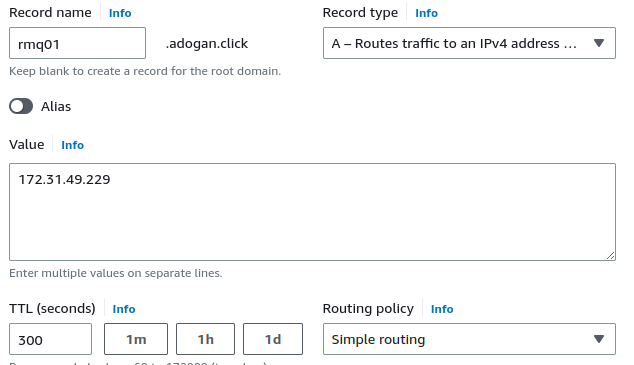

- Now we will create records for our backend services. The purpose of this activity is we will use these record names in our `application.properties` file. Even if IP address of the services, our application won't need to change the config file.  
```sh
Simple Routing -> Define Simple Record
Value/Route traffic to: IP address or another value
```
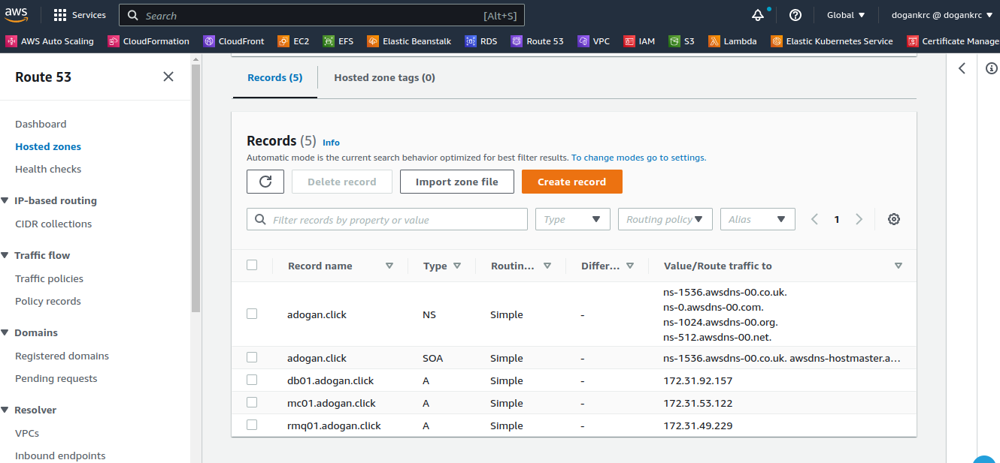

### Step-4: Provision Application EC2 instances with UserData script

- Create Tomcat instance with below details.We will also add Inbound rule to `vprofile-app-SG` for `SSH` on port `22`  from `MyIP` to be able to connect our db instance via SSH.
```sh
Name: vprofile-app01
Project: vprofile
AMI: Ubuntu 18.04
InstanceType: t2.micro
SecGrp: vprofile-app-SG
UserData: tomcat_ubuntu.sh
```

### Step-5: Create Artifact Locally with MAVEN

- Clone the repository.
```sh
git clone https://github.com/DOGAN2010/vprofile-project.git
```

- Before we create our artifact, we need to do changes to our `application.properties` file under `/src/main/resources` directory for below lines.
```sh
jdbc.url=jdbc:mysql://db01.dogankrc.click:3306/accounts?useUnicode=true&

memcached.active.host=mc01.dogankrc.click

rabbitmq.address=rmq01.dogankrc.click
```
- We will go to `vprofile-project` root directory to the same level pom.xml exists. Then we will execute below command to create our artifact `vprofile-v2.war`:

```sh
mvn install
```
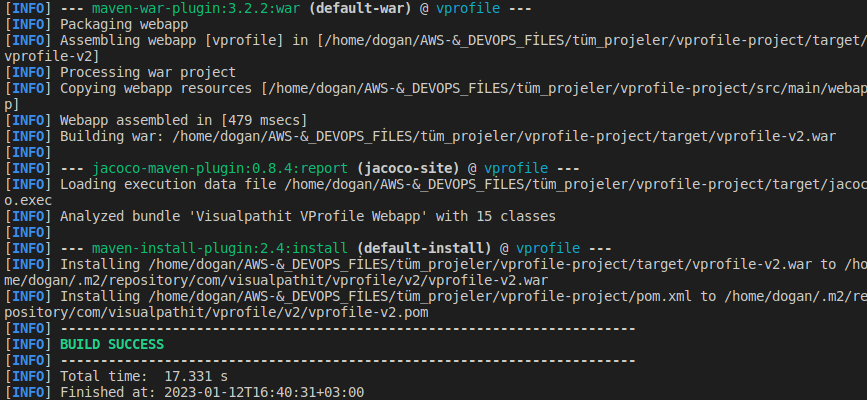


### Step-6: Create S3 bucket using AWS CLI, copy artifact

- We will upload our artifact to s3 bucket from AWS CLI and our Tomcat server will get the same artifact from s3 bucket.

- We will create an IAM user for authentication to be used from AWS CLI.
```sh
name: vprofile-s3-admin
Access key - Programmatic access
Policy: s3FullAccess
```


- Next we will configure our `aws cli` to use iam user credentials.
```sh
aws configure
AccessKeyID: 
SecretAccessKey:
region: us-east-1
format: json
```
- Create bucket. Note: S3 buckets are global so the naming must be UNIQUE!
```sh
aws s3 mb s3://vprofile-artifact-storage-rdogan
```
- Go to target directory and copy the artifact to bucket with below command. Then verify by listing objects in the bucket.
```sh
aws s3 cp vprofile-v2.war s3://vprofile-artifact-storage-rdogan
aws s3 ls vprofile-artifact-storage-rdogan
```
- We can verify the same from AWS Console.
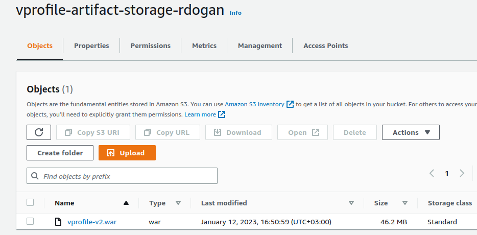

### Step-7: Download Artifact to Tomcat server from S3

- In order to download our artifact onto Tomcat server, we need to create IAM role for Tomcat. Once role is created we will attach it to our `app01` server.
```sh
Type: EC2
Name: vprofile-artifact-storage-role
Policy: s3FullAccess
```
- Before we login to our server, we need to add SSH access on port 22 to our `vprofile-app-SG`.

- Then connect to `app011` Ubuntu server.
```sh
ssh -i "vprofile-prod-key.pem" ubuntu@<public_ip_of_server>
sudo su -
systemctl status tomcat8
```

- We will delete `ROOT` (where default tomcat app files stored) directory under `/var/lib/tomcat8/webapps/`. Before deleting it we need to stop Tomcat server. 
```sh
cd /var/lib/tomcat8/webapps/
systemctl stop tomcat8
rm -rf ROOT
```
- Next we will download our artifact from s3 using aws cli commands. First we need to install `aws cli`. We will initially download our artifact to `/tmp` directory, then we will copy it under `/var/lib/tomcat8/webapps/` directory as `ROOT.war`. Since this is the default app directory, Tomcat will extract the compressed file.
```sh
apt install awscli -y
aws s3 ls s3://vprofile-artifact-storage-rdogan
aws s3 cp s3://vprofile-artifact-storage-rdogan/vprofile-v2.war /tmp/vprofile-v2.war
cd /tmp
cp vprofile-v2.war /var/lib/tomcat8/webapps/ROOT.war
systemctl start tomcat8
```

- We can also verify `application.properties` file has the latest changes.
```sh
cat /var/lib/tomcat8/webapps/ROOT/WEB-INF/classes/application.properties
```

- We can validate network connectivity from server using `telnet`.
```sh
apt install telnet
telnet db01.adogan.click 3306
```

### Step-8: Setup LoadBalancer

- Before creating LoadBalancer , first we need to create Target Group.
```sh
Intances
Target Grp Name: vprofile-elb-TG
protocol-port: HTTP:8080
healtcheck path : /login
Advanced health check settings
Override: 8080
Healthy threshold: 3
available instance: app01 (Include as pending below)
```

- Now we will create our Load Balancer.
```sh
vprofile-prod-elb
Internet Facing
Select all AZs
SecGrp: vprofile-elb-secGrp
Listeners: HTTP, HTTPS
Select the certificate for HTTPS
```

### Step-9: Create Route53 record for ELB endpoint

- We will create an A record with alias to ALB so that we can use our domain name to reach our application.

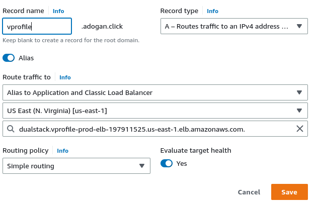

- Lets check our application using our DNS. We can securely connect to our application!

  

### Step-10: Configure AutoScaling Group for Application Instances

- We will create an AMI from our App Instance.


- Next we will create a Launch template using the AMI created in above step for our ASG.
```sh
Name: vprofile-app-LT
AMI: vprofile-app-image
InstanceType: t2.micro
IAM Profile: vprofile-artifact-storage-role
SecGrp: vprofile-app-SG
KeyPair: vprofile-prod-key
```

- Our Launch template is ready, now we can create our ASG.
```sh
Name: vprofile-app-ASG
ELB healthcheck
Add ELB
Min:1
Desired:2
Max:4
Target Tracking-CPU Utilization 50
```
- If we terminate any instances we will see ASG will create a new one using LT that we created.


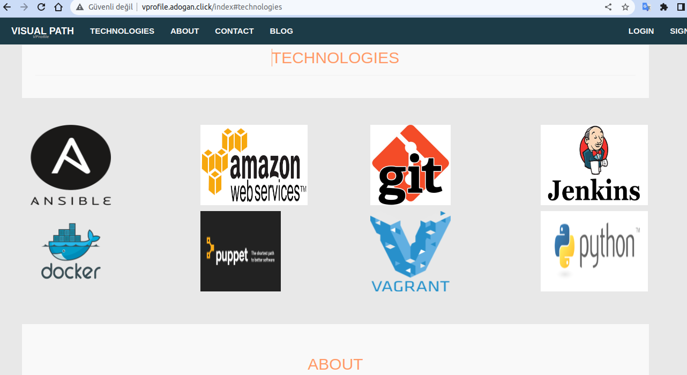

### Step-11: Clean-up

- Delete all resources we created to avoid any charges from AWS.


```
git add .
git commit -m "Project-3: Lift and Shift Application Workload to AWS"
git push --set-upstream origin aws-LiftAndShift
git checkout main
git merge aws-LiftAndShift
git push origin main

```


# Project-4: Re-Architecting Web App on AWS Cloud[Cloud Native]

[*Project Source*](https://www.udemy.com/course/devopsprojects/?src=sac&kw=devops+projects)

## Pre-requisites:
  * AWS Account
  * Default VPC
  * Route53 Public Registered Name
  * Maven
  * JDK8

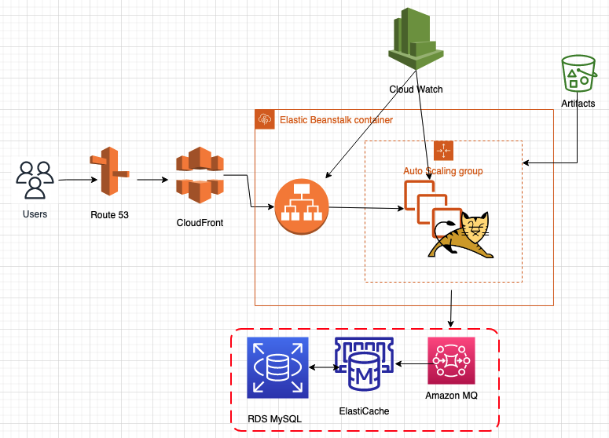

## Preparing Bash Scripts for VMs

```sh
git checkout aws-Refactor
```

### Step-1: Create Keypair for Beanstalk EC2 Login

- We will create a key pair to be used with Elastic Beanstalk. Go to `EC2` console, on left menu select `KeyPair` -> `Create key pair`.
```sh
Name: vprofile-bean-key
```
- Remember where to download the private key, it will be used when logging in to EC2 via SSH.

### Step-2: Create Security Group for ElastiCache, RDS and ActiveMQ

- Create a Security Group with name `vprofile-backend-db-sg`. Once it is created we need to edit `Inbound` rules:
```sh
All Traffic from `vprofile-backend-db-sg`
```  

### Step-3: Create RDS Database

#### Create Subnet Group:

- First we will create `Subnet Groups` with below properties:
```sh
Name: vprofile-rds-sub-grp
AZ: Select All
Subnet: Select All
```

#### Create Parameter Group

- We will create a parameter group to be used with our RDS instance. If we want to use default parameter group we don't need to create one. With parameter group, we are able make updates to default parameter for our RDS instance.

```sh
Parameter group family: mysql5.7
Type: DB Parameter Group
Group Name: vprofile-rds-para-grp
```

#### Create Database

- We will create RDS instance with below properties:
```sh
Method: Standard Create
Engine Options: MySQL
Engine version: 5.7.22 or 33
Templates: Free-Tier
DB Instance Identifier: vprofile-rds-mysql
Master username: admin
Password: Auto generate psw
Instance Type: db.t2.micro or db.t3.micro
Subnet grp: vprofile-rds-sub-grp
SecGrp:  vprofile-backend-db-sg
No public access
DB Authentication: Password authentication # sNwx6vrmC1wz2P8GvBtxadmin
Additional Configuration
Initial DB Name: accounts
DB Parameter Group: vprofile-rds-para-grp
Keep the rest default or you may add as your own preference
```

- After clicking `Create` button, you will see a popup. Click `View credential details` and note down auto-generated db password. We will use it in our application config files.

### Step-3: Create ElastiCache


#### Create Parameter Group

- We will create a parameter group to be used with our ElastiCache instance. If we want to use default parameter group we don't need to create one. With parameter group, we are able make updates to default parameters for our ElasticCache instance.

```sh
Name: vprofile-memcached-para-grp
Description: vprofile-memcached-para-grp
Family: memcached1.4
```

#### Create Subnet Group:

- First we will create `Subnet Groups` with below properties:
```sh
Name: vprofile-memcached-sub-grp
AZ: Select All
Subnet: Select All
```

#### Create Memcached Cluster

- Go to `Get Started` -> `Create Clusters` -> `Memcached Clusters`
```sh
Name: vprofile-elasticache-svc
Engine version: 1.4.5
Parameter Grp: vprofile-memcached-para-grp
NodeType: cache.t2.micro
# of Nodes: 1
SecGrp: vprofile-backend-db-sg
```

### Step-4: Create Amazon MQ

- We will create Amazon MQ service with below properties:
```sh
Engine type: RabbitMQ
Single-instance-broker
Broker name: vprofile-rmq
Instance type: mq.t3.micro
username: rabbit
psw: dogan123456789
Additional Settings:
private Access
VPC: use default
SEcGrp: vprofile-backend-db-sg
```

- Do not forget to note down tour username/pwd. You won't be able to see your Password again from console.

### Step-5: DB Initialization

- Go to RDS instance copy endpoint.
```sh
vprofile-rds-mysql.cxqw9zaxqpje.us-east-1.rds.amazonaws.com
```

- Create an EC2 instance to initialize the DB, this instance will be terminated after initialization.
```sh
Name: mysql-client
OS: ubuntu 18.04
t2.micro
SecGrp: Allow SSH on port 22
Keypair: vprofile-prod-key
Userdata:
#! /bin/bash
apt update -y
apt upgrade -y
apt install mysql-client -y
```

- SSH into `mysl-client` instance. We can check mysql version
```sh
mysql -V
```

- Before we login to database, we need to update `vprofile-backend-db-sg` Inbound rule to allow connection on port 3306 for `mysql-client-SG`
After updating rule, try to connect with below command:
```sh
mysql -h vprofile-rds-mysql.cxqw9zaxqpje.us-east-1.rds.amazonaws.com -u admin -p<db_password>
mysql> show databases;
```

- Next we will clone our source code here to use script to initialize our database. After these commands we should be able to see 2 tables `role`, `user`, and `user_role`.

```sh
git clone https://github.com/DOGAN2010/vprofile-project.git
cd vprofile-project
git checkout aws-Refactor
cd src/main/resources
mysql -h vprofile-rds-mysql.cxqw9zaxqpje.us-east-1.rds.amazonaws.com -u admin -psNwx6vrmC1wz2P8GvBtx accounts < db_backup.sql
mysql -h vprofile-rds-mysql.cxqw9zaxqpje.us-east-1.rds.amazonaws.com -u admin -psNwx6vrmC1wz2P8GvBtx accounts
show tables;
```

### Step-5: Create Elastic Beanstalk Environment

- Our backend services are ready now. We will copy their endpoints from AWS console. These information will be used in our `application.properties` file
```sh
RDS:
vprofile-rds-mysql.chrgxmhxkprk.us-east-1.rds.amazonaws.com:3306
ActiveMQ: amqps://b-b7d7bbcb-3894-4af7-8048-726a9ceabc43.mq.us-east-1.amazonaws.com:5671
ElastiCache:
vprofile-elasticache-svc.eqmmsw.cfg.use1.cache.amazonaws.com:11211
```

#### Create Application

- Application in Elastic Beanstalk means like a big container which can have multiple environments. Since out app is Running on Tomcat we will choose `Tomcat` as platform.
```sh
Name: vprofilejavaapp-prod-rd
Platform: Tomcat
keep the rest default
Configure more options:
- Custom configuration
****Instances****
EC2 SecGrp: vprofile-backend-db-sg
****Capacity****
LoadBalanced
Min:2
Max:4
InstanceType: t2.micro
****Rolling updates and deployments****
Deployment policy: Rolling
Percentage :50 %
****Security****
EC2 key pair: vprofile-bean-key
```

### Step-5: Update Backend SecGrp & ELB

- Our application instances created by BeanStalk will communicate with Backend services. We need update `vprofile-backend-db-sg` to allow connection from our appSecGrp created by Beanstalk on port `3306`, `11211` and `5671` 
```sh
Custom TCP 3306 from Beanstalk SecGrp(you can find id from EC2 insatnces)
Custom TCP 11211 from Beanstalk SecGrp
Custom TCP 5671 from Beanstalk SecGrp
```


- In Elastic Beanstalk console, under our app environment, we need to clink Configuration and do below changes and apply:
```sh
Add Listener HTTPS port 443 with SSL cert
Processes: Health check path : /login
```

### Step-6: Build and Deploy Artifact

- Go to directory that we cloned project, we need to checkout aws-refactor branch. Update below fields in `application.properties` file with correct endpoints and username/pwd.
```sh
vim src/main/resources/application.properties
*****Updates*****
jdbc.url
jdbc.password
memcached.active.host
rabbitmq.address
rabbitmq.username
rabbitmq.password
```

- Go to root directory of project to the same level with `pom.xml` file. Run below command to build the artifact.
```sh
mvn install
``` 

#### Upload Artifact to Elastic Beanstalk

- Go to Application versions and Upload the artifact from your local. It will autmatically upload the artifact to the S3 bucket created by Elasticbeanstalk.

- Now we will select our uploaded application and click Deploy.

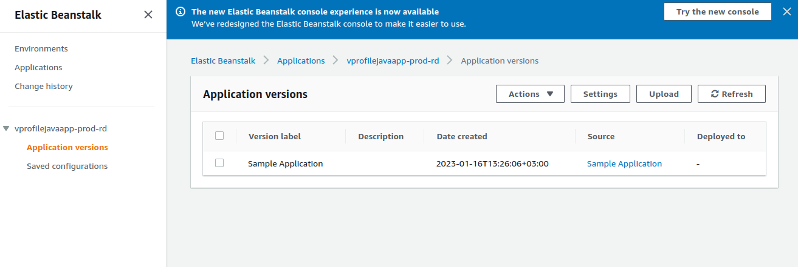

- Let's check if our application deployed successfully.

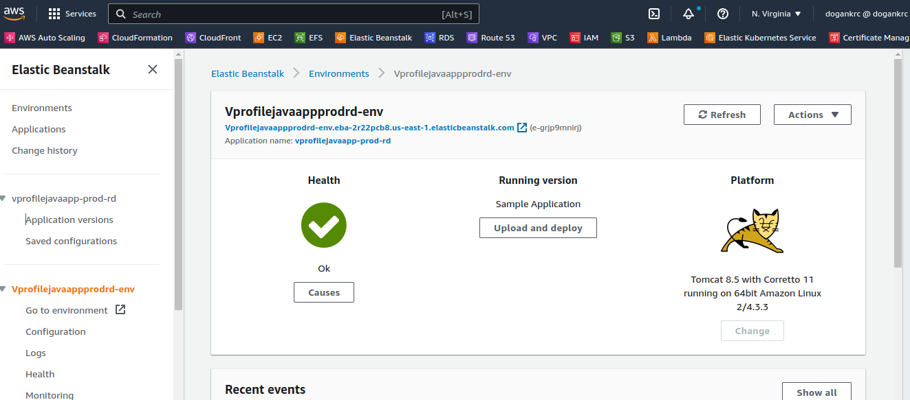
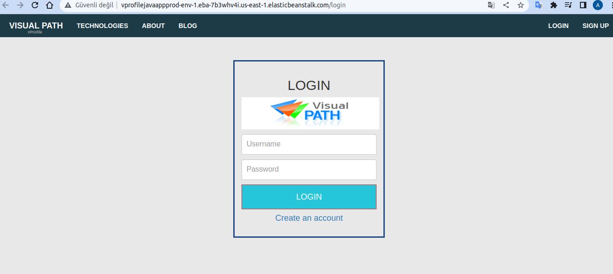

### Step-7: Create DNS Record in Route53 for Application

- We will create an A record which aliasing Elastic Beanstalk endpoint.

- Now we can reach our application securely with DNS name we have given.

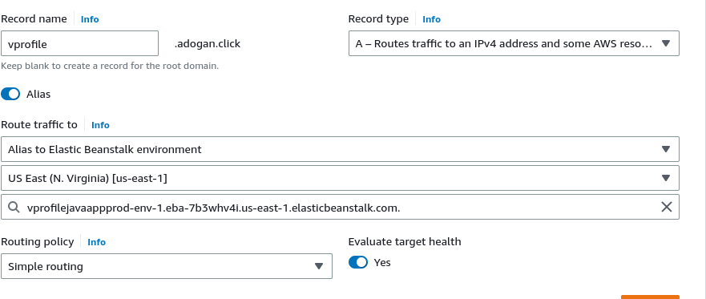

### Step-8: Create Cloudfront Distribution for CDN

- Cloudfront is Content Delivery Nettwork service of AWS. It uses Edge Locations around the world to deliver contents globally with best performance. We will to `CloudFront` and create a distribution.
```sh
Origin Domain: DNS record name we created for our app in previous step
Viewer protocol: Redirect HTTP to HTTPS
Alternate domain name: DNS record name we created for our app in previous step
SSL Certificate: 
Security policy: TLSv1
``` 
- Now we can check our application from browser.

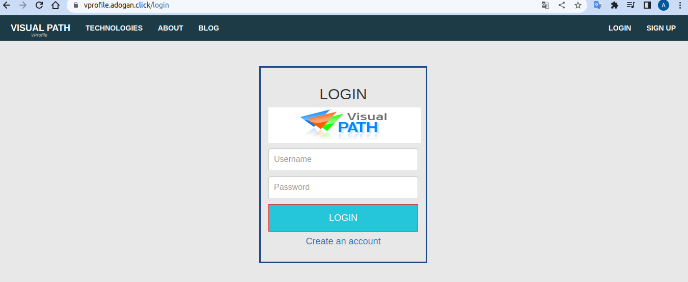

### Step-9: Clean-up

- We will delete all resources that we have created throughout the project.

```
git add .
git commit -m "Project-4:Re-Architecting Web App on AWS Cloud[Cloud Native]"
git push --set-upstream origin aws-Refactor
git checkout main
git merge aws-Refactor
git push origin main

```


